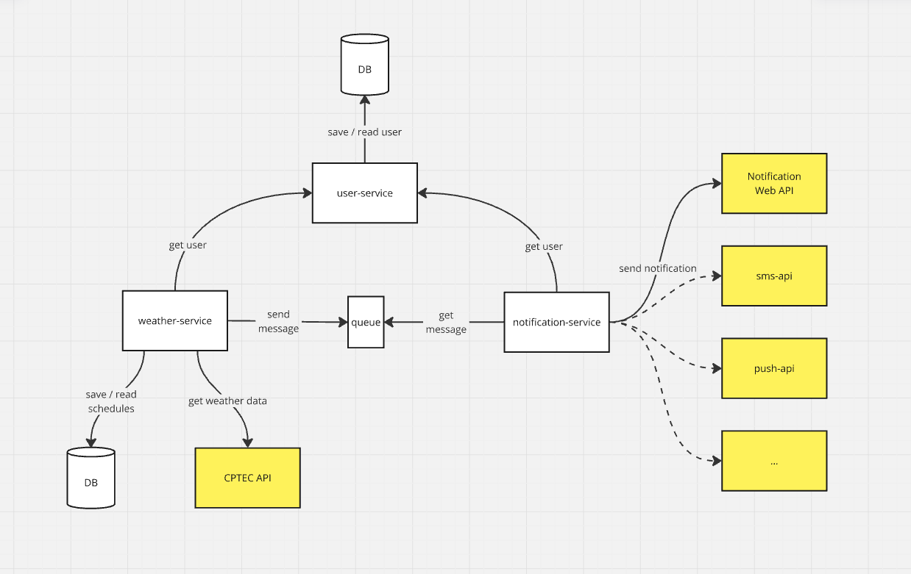

# Weather



O docker-compose contém os serviços:

* user-service: micro-serviço para cadastro e consulta de usuários
* weather-service: micro-serviço consulta e agendamento de previsão do tempo
* notification-service: micro-serviço para envio de notificações para diferentes canais

Além de containeres auxiliares para o funcionamento destes:

* rabbitmq: Broker de mensageria
* postgres: Banco de dados relacional
* web-notification-api-mock: Mock de uma API web para envio de notificações

Para buildar os containeres:

```sh
docker-compose build
```

E para subir:

```sh
docker-compose up
```

## Chamando as APIs

Considerando que as APIs subiram em localhost.

```sh
curl --location 'http://localhost:8080/user-service/user' \
--header 'Content-Type: application/json' \
--data '{
    "name": "Fernando",
    "webNotificationId": "EXTERNAL-1"
}'
```

Esse request retornará uma resposta no formato:

```json
{
    "id": "USER-89315600-ad8c-46e5-9199-a7fea26d18ac",
    "name": "Fernando",
    "notification": {
        "enabled": true,
        "web": {
            "enabled": true,
            "id": "EXTERNAL-1"
        }
    }
}
```

Para os próximos requests, use o `id` do usuário ou, se preferir, use o usuário de teste já cadastrado na base `USER-30ed8a98-e9fd-49e3-a0b4-5b620ea90caf`

Para enviar uma notificação com a previsão do tempo:

```sh
curl --location 'http://localhost:8081/weather-service/notify' \
--header 'Content-Type: application/json' \
--data '{
    "userId": "USER-89315600-ad8c-46e5-9199-a7fea26d18ac",
    "city": "rio de janeiro",
}'
```

Ou agende um envio:

```sh
curl --location 'http://localhost:8081/weather-service/schedule' \
--header 'Content-Type: application/json' \
--data '{
    "userId": "USER-30ed8a98-e9fd-49e3-a0b4-5b620ea90caf",
    "city": "rio de janeiro",
    "time": "2025-02-10T03:20:12-03:00"
}'
```

Após o envio, o log do web-notification-api-mock mostrará a notificação:

```
web-notification-api-mock-1  | NOTIFICATION RECEIVED
web-notification-api-mock-1  | ID: EXTERNAL-1
web-notification-api-mock-1  | Fernando, aqui está a previsão do tempo para Rio de Janeiro
web-notification-api-mock-1  | 
web-notification-api-mock-1  | 10/02/2025: 23 - 32
web-notification-api-mock-1  | 11/02/2025: 23 - 33
web-notification-api-mock-1  | 12/02/2025: 24 - 35
web-notification-api-mock-1  | 13/02/2025: 25 - 36
web-notification-api-mock-1  | 
web-notification-api-mock-1  | Ondas para o dia 09/02/2025:
web-notification-api-mock-1  | Manhã: Fraco 1.00m
web-notification-api-mock-1  | Tarde: Fraco 1.00m
web-notification-api-mock-1  | Noite: Fraco 1.00m
```

## Desabilitar notificações

Para desabilitar as notificações para um usuário, chame:

```sh
curl -X POST --location 'http://localhost:8080/user-service/user/{userID}/optout'
```